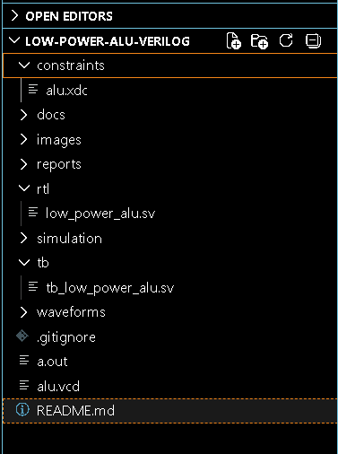
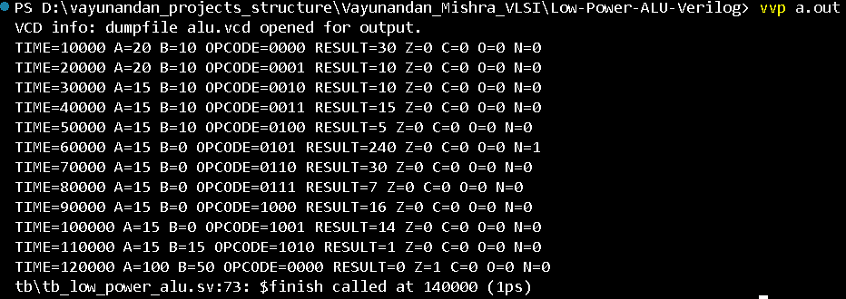
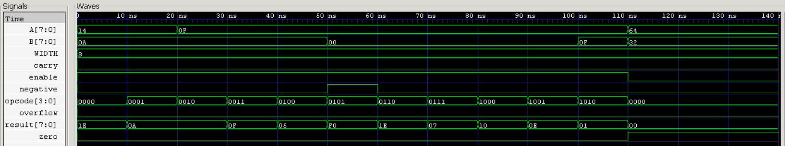
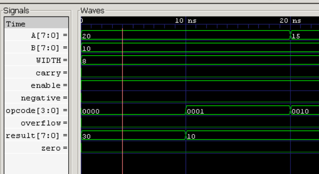
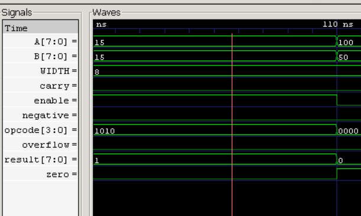
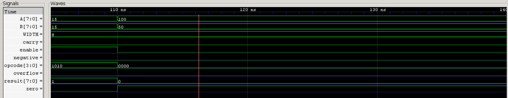

# 🚀 Low-Power ALU Design Using Verilog

## 📌 Overview

The **Low-Power Arithmetic Logic Unit (ALU)** is a fundamental component of modern processors responsible for performing arithmetic and logical operations. This project implements an **8-bit Low-Power ALU using SystemVerilog**, demonstrating core VLSI design concepts including RTL design, combinational logic, operand isolation, functional verification, waveform analysis, and FPGA-ready implementation.

A low-power design approach is incorporated using **operand isolation**, reducing unnecessary switching activity and illustrating power-aware RTL design techniques commonly used in modern ASIC and FPGA development.

---

## 👨‍💻 Author

**Vayunandan Mishra**

* VLSI Design Enthusiast
* RTL Design Engineer Aspirant
* FPGA & Digital Design Learner
* Electronics and Communication Engineering

---

# 🎯 Project Objectives

* Design an 8-bit parameterized ALU using SystemVerilog
* Implement arithmetic and logical operations
* Generate processor status flags
* Demonstrate low-power design using operand isolation
* Verify functionality through simulation
* Analyze waveforms using GTKWave
* Create an FPGA-ready synthesizable design
* Build an industry-oriented VLSI portfolio project

---

# 🏗️ Architecture

```text
                +----------------------+
A[7:0] -------->|                      |
                |                      |
B[7:0] -------->|  Operand Isolation   |
                |                      |
Enable -------->|                      |
                +----------+-----------+
                           |
                           v
                    Opcode Decoder
                           |
                           v
                   +---------------+
                   |      ALU      |
                   +---------------+
                           |
                           v
                +-------------------+
                | Flag Generation   |
                +-------------------+
                           |
          +----------------+----------------+
          |                |                |
          v                v                v

       Result          Carry Flag     Zero Flag
                                       
                     Overflow Flag
                     Negative Flag
```

---

# ⚡ Low-Power Concept

## Operand Isolation

The project uses operand isolation to reduce dynamic power consumption.

```systemverilog
A_iso = enable ? A : 0;
B_iso = enable ? B : 0;
```

When `enable = 0`, internal switching activity is minimized because operands are forced to zero.

### Benefits

* Reduced switching activity
* Lower dynamic power consumption
* Reduced heat generation
* Improved energy efficiency

---

# 🔧 ALU Operations

| Opcode | Operation   |
| ------ | ----------- |
| 0000   | ADD         |
| 0001   | SUB         |
| 0010   | AND         |
| 0011   | OR          |
| 0100   | XOR         |
| 0101   | NOT A       |
| 0110   | SHIFT LEFT  |
| 0111   | SHIFT RIGHT |
| 1000   | INCREMENT   |
| 1001   | DECREMENT   |
| 1010   | COMPARE     |

---

# 🚩 Flag Generation

| Flag     | Description                                 |
| -------- | ------------------------------------------- |
| Zero     | Result equals zero                          |
| Carry    | Carry generated during arithmetic operation |
| Overflow | Signed arithmetic overflow                  |
| Negative | MSB of result is 1                          |

---

# 🛠️ Tools Used

| Tool              | Purpose                         |
| ----------------- | ------------------------------- |
| SystemVerilog     | RTL Design                      |
| Icarus Verilog    | Compilation & Simulation        |
| GTKWave           | Waveform Analysis               |
| VS Code           | Development Environment         |
| GitHub            | Version Control                 |
| Vivado (Optional) | FPGA Synthesis & Implementation |

---

# 📂 Project Structure

```text
Low-Power-ALU-Verilog/

├── rtl/
│   └── low_power_alu.sv
│
├── tb/
│   └── tb_low_power_alu.sv
│
├── constraints/
│   └── alu.xdc
│
├── docs/
│   
│
├── images/
│   ├── rtl_code.png
│   ├── testbench.png
│   ├── waveform.png
│   ├── simulation_output.png
│   └── architecture.png
│
├── reports/
│     └──Project_Report.pdf
├── README.md
│
└── .gitignore
```

---

# ▶️ Simulation Flow

## Compile

```bash
iverilog -g2012 rtl/low_power_alu.sv tb/tb_low_power_alu.sv
```

## Run Simulation

```bash
vvp a.out
```

## Open Waveform

```bash
gtkwave alu.vcd
```

---

# 📊 Verification Results

### Arithmetic Operations

✔ Addition

✔ Subtraction

✔ Increment

✔ Decrement

### Logical Operations

✔ AND

✔ OR

✔ XOR

✔ NOT

### Shift Operations

✔ Shift Left

✔ Shift Right

### Comparison

✔ Equality Detection

### Low-Power Verification

✔ Operand Isolation Verified

---

# 📷 Project Screenshots

## Project Structure

<p align="center">
  
</p>

## Simulation Output

<p align="center">
  
</p>

## Waveform Analysis

<p align="center">
  
</p>

## ADD Operation Verification

<p align="center">
  
</p>

## Compare Operation Verification

<p align="center">
  
</p>

## Operand Isolation Verification

<p align="center">
  
</p>

---

# 📈 Waveform Analysis

The generated waveform confirms:

* Correct opcode decoding
* Proper arithmetic execution
* Accurate logical operation outputs
* Successful flag generation
* Correct compare operation
* Operand isolation functionality when enable is disabled

---

# 🔍 Sample Results

| Test Case       | Expected | Result |
| --------------- | -------- | ------ |
| 20 + 10         | 30       | PASS   |
| 20 - 10         | 10       | PASS   |
| 15 AND 10       | 10       | PASS   |
| 15 OR 10        | 15       | PASS   |
| 15 XOR 10       | 5        | PASS   |
| NOT 15          | 240      | PASS   |
| 15 << 1         | 30       | PASS   |
| 15 >> 1         | 7        | PASS   |
| Increment 15    | 16       | PASS   |
| Decrement 15    | 14       | PASS   |
| Compare 15 & 15 | 1        | PASS   |

---

# 🎓 VLSI Concepts Demonstrated

* RTL Design
* SystemVerilog Coding
* Combinational Logic Design
* ALU Architecture
* Multiplexer-Based Operation Selection
* Processor Flag Generation
* Low-Power Design Concepts
* Operand Isolation
* Functional Verification
* Waveform Debugging
* FPGA Design Flow

---

# 💼 Industry Relevance

Similar concepts are widely used in:

* CPU Design
* Microcontrollers
* DSP Processors
* Mobile Processors
* Embedded Systems
* IoT Chips
* AI Accelerators
* ASIC Development

---

# 🚀 Future Enhancements

* 16-bit / 32-bit ALU
* Clock Gating
* Power Gating Concepts
* Functional Coverage
* Assertions (SVA)
* Self-Checking Testbench
* FPGA Hardware Validation
* Advanced Power Analysis
* UVM-Based Verification

---

# 📷 Project Screenshots

Add the following screenshots inside the `images/` folder:

* RTL Code
* Testbench Code
* Successful Compilation
* Simulation Output
* GTKWave Waveform
* Operand Isolation Verification
* Architecture Diagram
* GitHub Repository Preview

---

# 📄 Documentation

Detailed project documentation is available in:

```text
reports/Project_Report.pdf
```

---

# ⭐ Learning Outcomes

Through this project, the following skills were developed:

* RTL Design using SystemVerilog
* Digital Logic Design
* Functional Verification
* Waveform Analysis
* Low-Power Design Concepts
* FPGA Development Flow
* Git & GitHub Project Management
* VLSI Documentation Practices

---

# 📬 Connect

If you found this project useful, feel free to star the repository and connect with me for discussions on VLSI, FPGA Design, RTL Development, and Digital Design Engineering.

⭐ If you like this project, don't forget to star the repository!
